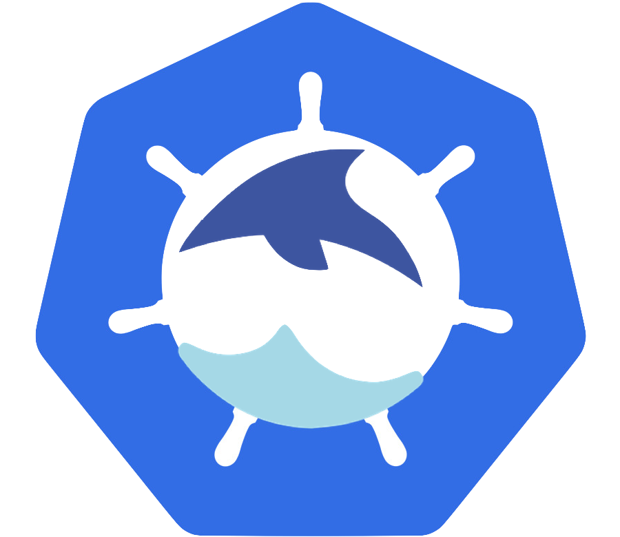

# Tremor for Kubernetes and OpenShift



This project derives from work by the Kubernetes team at Wayfair of general
interest to users of Tremor and Kubernetes. The original work was by [Njegos Railic](https://github.com/njegosrailic) from Wayfair's Kubernetes SRE Team.

Support for OpenShift was investigated by [Anton Whalley](https://github.com/No9).

The project can be used as a template for deploying standard tremor installation
for Kubernetes. This project can be forked and modified for specific use cases.

Generally useful enhancements, improvements, fixes and changes that are encouraged.
If you have made a change you would like to contribute please submit a pull request!

## Getting started

This project assumes familiarity with Tremor, Kubernetes and Helm. Additionally, it
assumes that you already have `helm` and `kubectl` binary installed.

## Get Repo Info

For now we don't have a public Helm registry configured and you would have to download
helm chart and add it to your Helm registry.

You would have to manually create helm package:

```bash
$ helm package charts/tremor
Successfully packaged chart and saved it to: /Users/njegosrailictremor-k8s-helm/tremor-0.1.0.tgz

```

### Adding tremor Helm chart to a Helm registry

```console
helm repo update
```

_See [helm repo](https://helm.sh/docs/helm/helm_repo/) for command documentation._

### Install tremor directly from helm chart package

We may need to install tremor directly from a package and recreate
the existing release. After the package is created we can execute the 
following commands:

```bash
$ helm install [RELEASE_NAME] tremor-kuberenetes-0.1.0.tgz
$ helm delete [RELEASE_NAME]
```

## Install Chart

Please check the following command for Helm v3:

```console
# Helm install with tremor namespace already created
$ helm install -n tremor [RELEASE_NAME] [HELM_REPO_NAME]]/tremor

# Helm install and create namespace
$ helm install -n tremor [RELEASE_NAME] [HELM_REPO_NAME]]/tremor --create-namespace

```

_See [parameters](#parameters) below._

_See [helm install](https://helm.sh/docs/helm/helm_install/) for command documentation._

### Validate deployments

Check that our release has deployed ok:

```bash
$ kubectl get pod -n tremor-test
NAME                           READY   STATUS    RESTARTS   AGE
tremor-test-84f659495d-5v759   1/1     Running   0          75m
```

Inspect the log output for any other deployment errors:

```bash
$ kubectl logs tremor-test-84f659495d-5v759 -n tremor-test

+ [ -n  ]
+ [ -z ]
+ TREMOR_DIR=/etc/tremor
...
+ ARGS=server run --logger-config /etc/tremor/logger.yaml -f  /etc/tremor/config/*.yaml /etc/tremor/config/*.trickle
+ exec /usr/bin/tini /tremor -- server run --logger-config /etc/tremor/logger.yaml -f /etc/tremor/config/config.yaml /etc/tremor/config/main.trickle
tremor version: 0.11.4 HEAD:0c643f419124c0484a817202e0d7a79a33996dd3
tremor instance: tremor
rd_kafka version: 0x000000ff, 1.5.0
allocator: snmalloc
2021-06-03T11:24:44.944326589+00:00 INFO tremor_runtime::version - tremor version: 0.11.4 HEAD:0c643f419124c0484a817202e0d7a79a33996dd3
2021-06-03T11:24:44.944565360+00:00 INFO tremor_runtime::version - rd_kafka version: 0x000000ff, 1.5.0
2021-06-03T11:24:44.945046744+00:00 INFO tremor_runtime::onramp - Onramp manager started
2021-06-03T11:24:44.945343680+00:00 INFO tremor_runtime::offramp - Offramp manager started
2021-06-03T11:24:44.945491373+00:00 INFO tremor_runtime::pipeline - Pipeline manager started
2021-06-03T11:24:45.035620164+00:00 INFO tremor_runtime::system - Binding pipeline tremor://localhost/pipeline/system::metrics/system/in

...


...

{"onramp":"metronome","ingest_ns":1621942260121807140,"id":486}
{"onramp":"metronome","ingest_ns":1621942270121987716,"id":487}
{"onramp":"metronome","ingest_ns":1621942280122466690,"id":488}
{"onramp":"metronome","ingest_ns":1621942290101218178,"id":489}
{"onramp":"metronome","ingest_ns":1621942300101332444,"id":490}
```

If you can see metronome events with the default example then your deployment looks good!

In case something goes wrong you can always check events to see what's going on.

```bash
$ kubectl get events --sort-by=.metadata.creationTimestamp -n tremor-test

LAST SEEN   TYPE      REASON                         OBJECT                                MESSAGE
4m16s       Normal    SuccessfulCreate               replicaset/tremor-test-84f659495d     Created pod: tremor-test-84f659495d-5v759
4m16s       Normal    Scheduled                      pod/tremor-test-84f659495d-5v759      Successfully assigned tremor-test/tremor-test-84f659495d-5v759 to gke-44c3ebc6-2nqu
4m16s       Normal    ScalingReplicaSet              deployment/tremor-test                Scaled up replica set tremor-test-84f659495d to 1
4m14s       Normal    Pulled                         pod/tremor-test-84f659495d-5v759      Container image "tremorproject/tremor:0.11.4" already present on machine
4m14s       Normal    Created                        pod/tremor-test-84f659495d-5v759      Created container tremor
4m14s       Normal    Started                        pod/tremor-test-84f659495d-5v759      Started container tremor
```

By default HPA is disabled. Once you enable it you can check configuration:

```bash
$ kubectl get hpa -n tremor-test
NAME          REFERENCE                TARGETS          MINPODS   MAXPODS   REPLICAS   AGE
tremor-test   Deployment/tremor-test   5%/50%, 4%/50%   1         2         1          3h6m
```

```bash
$ kubectl describe hpa.v2beta2.autoscaling tremor-test -n tremor-test
Name:                                                     tremor-test
Namespace:                                                tremor-test
Labels:                                                   app=tremor-test
                                                          chart=tremor-0.1.0-rc.5.b4b8b7851
                                                          component=tremor
                                                          heritage=Tiller
                                                          release=tremor-test
Annotations:                                              <none>
CreationTimestamp:                                        Thu, 03 Jun 2021 11:46:08 +0200
Reference:                                                Deployment/tremor-test
Metrics:                                                  ( current / target )
  resource memory on pods  (as a percentage of request):  5% (14409728) / 50%
  resource cpu on pods  (as a percentage of request):     4% (4m) / 50%
Min replicas:                                             1
Max replicas:                                             2
Deployment pods:                                          1 current / 1 desired
Conditions:
  Type            Status  Reason              Message
  ----            ------  ------              -------
  AbleToScale     True    ReadyForNewScale    recommended size matches current size
  ScalingActive   True    ValidMetricFound    the HPA was able to successfully calculate a replica count from memory resource utilization (percentage of request)
  ScalingLimited  False   DesiredWithinRange  the desired count is within the acceptable range
Events:           <none>

```

## Helm Chart Repository

We use github pages to host a generated helm chart repository for helm chart releases [here](https://tremor-rs.github.io/tremor-k8s-helm/).

